<!--Title @davisbuilds-->
<h1 align="left">👋 Hi, I’m @davisbuilds</h1>

> "We are what we repeatedly do. Excellence, then, is not an act, but a habit." - Aristotle 

<h2 align="left">Skills</h2>

  
  
  
  
  
  
  
  
  
  
  
  
  

<h2 align="left">Projects</h2>

- 🥋 [**dojo**](https://github.com/davisbuilds/dojo) - Extensible framework for AI agents (skills, hooks, etc)
- 📊 [**agentmonitor**](https://github.com/davisbuilds/agentmonitor) - Analytics dashboard for monitoring the (agent) situation
- 📰 [**feed**](https://github.com/davisbuilds/feed) - Intelligent newsletter digest CLI
- 📄 [**fetchmd**](https://github.com/davisbuilds/fetchmd) - Token-efficient webpage-to-markdown CLI for AI agents
- 🌿 [**envdiff**](https://github.com/davisbuilds/envdiff) - Deterministic environment contract analysis CLI for repositories
- 🔍 [**mlsearch**](https://github.com/davisbuilds/mlsearch) - Autoresearch-esque semantic paper search experiment for arXiv cs.LG
- 💬 [**qotd**](https://github.com/davisbuilds/qotd) - Quote of the day web app
- 📚 [**compendium**](https://github.com/davisbuilds/compendium) - A curated collection of advice from successful entrepreneurs
- 🧠 [**prompts**](https://github.com/davisbuilds/prompts) - Davis's prompts collection
- 🧪 [**resnet-cifar10**](https://github.com/davisbuilds/resnet-cifar10) - Codex 5.3 one-shot experiment
- 🔤 [**slugify**](https://github.com/davisbuilds/slugify) - Spec driven library for AI agents, convert any text to URL-safe slugs
- 🔡 [**caseshift**](https://github.com/davisbuilds/caseshift) - Spec driven library for AI agents, universal case conversion

<h2 align="left">GitHub Stats</h2>

